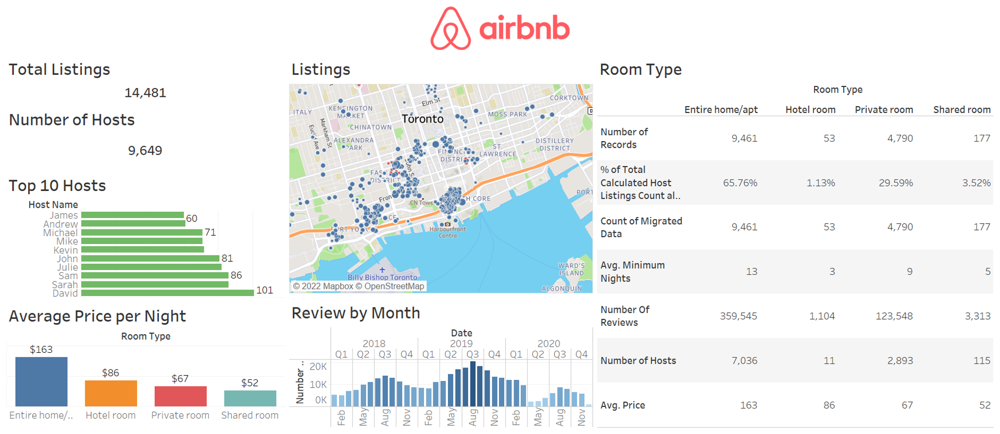

# Rental-Property-Data-Engineering

Utilized the Tableau visualizations tool to conduct data analysis for a rental property dataset. This analysis considers the correlations between listings, hosts, neighbourhoods, monthly reviews, room types, and the average price per night. Please view the Rental Property Data pdf file included in the repository to view the summarized dashboard of the visualizations.

